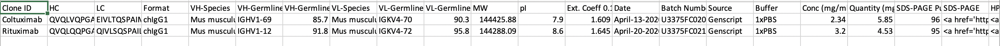
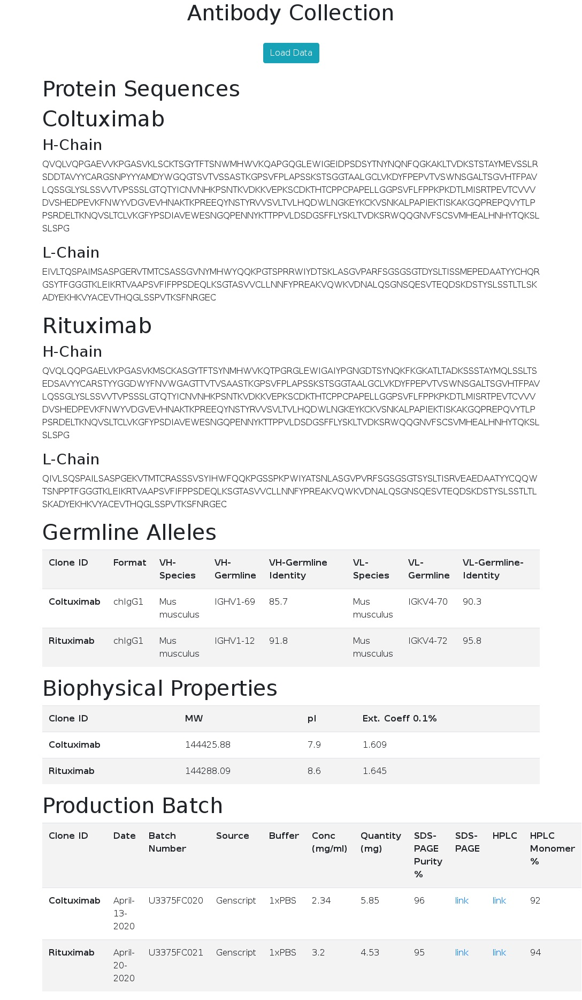

# antibody-csv-to-html
Javascript to convert antibody information from csv to html 

# Usage
Javascript converts antibody data from csv to html. For example: 

1. Split csv table into multiple tables and display them on a single html page
2. Display fasta sequences wrapped in excel cell in a more user-friendly way

# How to use it
## Prepare csv table

See [example csv](https://github.com/xinyu-dev/antibody-csv-to-html/blob/master/example.csv)

Note: to link a csv cell to file (e.g. link to a **png** file), use the syntax:
```
<a href='your_link'>link</a>	
```
For example, in the `example.csv` table, under SDS-PAGE and HPLC columns, you can find links such as:
```
<a href='https://github.com/xinyu-dev/antibody-csv-to-html/blob/master/Examples/Example%20SDS-PAGE.png'>link</a>	
```

## Customize your html and js codes

1. Download both `antibody_table_generator.html` and `antibody_table_generator.js` files. Use these as a template for furthur editing. 

2. Note that `antibody_table_generator.js` takes a string variable `data_url` as url of the csv file. You can set the value of this variable in the `antibody_table_generator.html` header. 

## Load data and view
Open `antibody_table_generator.html` and click the top button to load data. 

# Demo

## Screenshots of Input csv:



## Screenshots of Output html:



# Caveats
1. The example js and html files provided here uses `example.csv` hosted on github. If the csv file is local (i.e. not hosted by a server), you can still run the javascript using PhpStorm or similar (e.g. in PhpStorm > open `antibody_table_generator.html` > right click > run..Javascript). This works perfectly fine. 

However,if your csv file is local, and you try to load data directly from the `antibody_table_generator.html` opened in Chrome, you might get an error message such as this: 
```
Access to XMLHttpRequest at '....' from origin 'null' has been blocked by CORS policy: Cross origin requests are only supported for protocol schemes: http, data, chrome, chrome-extension, https.
```
Solution to this issue can be found [here](https://stackoverflow.com/questions/38344612/ajax-request-to-local-file-system-not-working-in-chrome)


